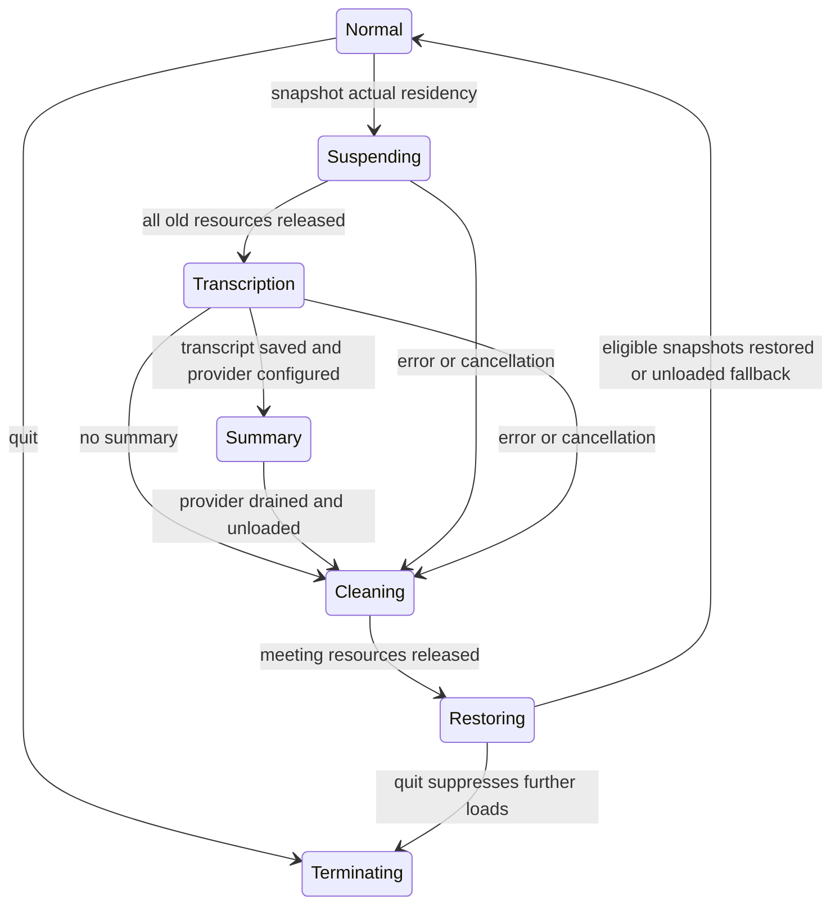

# Meeting model residency plan and implementation

Status: implemented, installed locally and running; regression, RAM and private-build evidence is recorded below. No release, commit or model download is part of this change.

## The sequence

1. Acquire the existing meeting/audio lease. Reject busy model operations before unloading anything; do not interrupt an active generation or installation.
2. Close ordinary model admission and snapshot actual loaded model IDs/configurations. No model references or selected-but-unloaded models enter this snapshot.
3. Unload dictation providers and Fluid. Await actual helper exit. Invalidate queued startup/dictation warmups.
4. Run the meeting backend. The Nemotron/WeSpeaker/Parakeet backend already has sequential scoped model owners. The legacy backend is also gated, but retains its existing diarizer + selected-ASR implementation and memory profile.
5. If a summary provider is registered, save the transcript first, load/generate through the adapter, and await cleanup on success, error or cancellation. Summary errors remain separate from the transcript.
6. After all meeting work has returned and its resources are released, restore only eligible snapshots, serially. Selection changes and explicit unloads can veto restoration; they cannot add a new model. Never download or delete files as part of restoration.
7. Resume ordinary admission and idle unloading. Quit suppresses restoration. Failed restoration leaves the model unloaded and logs the error without discarding a successful transcript.

Quit also applies from every intermediate phase. Cancellation never frees an in-use model underneath its inference call: the gate stays closed until that call returns. There is no persisted busy flag and no automatic replay of rejected warmups.

## Code ownership

- `MeetingModelResidencyCoordinator`: MainActor admission, unique generation per lease, scoped owner/model grants, immutable snapshot list, vetoes and joined restoration. A reused attempt ID cannot revive an old grant.
- `ASRService`: actual successfully loaded model identity; unload all speech-provider caches before meeting work; restore only a still-selected, installed snapshot. Existing meeting-ASR ownership drains Parakeet before returning.
- `PrivateAIIntegrationService`: guards load, prepare, verify, prewarm, inference and status paths. Update admission spans installation through commit/rollback. Idle unloading pauses during the meeting.
- Private bridge: captures actual ready runtime/configuration, restores without the settings action that deletes inactive models, and awaits helper exit. Retired helper clients reject late status calls instead of launching another process.
- `MeetingProcessingPipeline`: wraps both backend contracts, saves the completed transcript before optional post-processing, and returns summary errors separately.
- `MeetingSessionCoordinator`: still checks operation generation before publication; cancellation during optional summary can preserve a finished transcript when the attempt is still current.

## Summary plug-in contract

`MeetingPostProcessingProviding` supplies provider/model IDs, an input-character bound, non-loading readiness, preparation, and idempotent cleanup. `PreparedMeetingPostProcessor` supplies generation and awaited cancellation/unload. Provider cleanup must also drain a failed partial preparation. Neither cleanup may return while its model is still running.

Requests contain session/attempt IDs, transcript hash, language, speakers, segments and coverage gaps. Output contains a summary plus source-segment IDs. The host rejects oversized input, empty/oversized output and unknown source IDs. Artifacts are saved separately with model/provider provenance. No provider means no-op; no model has been chosen or downloaded. A real adapter still needs model-specific context limits, generation policy and its own memory measurements.

## Validation

- Deterministic tests cover actual-residency-only restoration, busy admission, vetoes, cancellation during non-cooperative work, partial suspension/snapshot failure, restoration failure, termination, stale/reused grants, legacy speech-only grants, queued warmup invalidation and summary preparation/generation/citation/cancellation failures.
- Real shared-service runs cover Parakeet loaded with Fluid unloaded, and Parakeet + Fluid Mini both loaded. They verify original identities return and the old helper exits before meeting inference.
- Full recording: **2.51 GB** meeting peak without Fluid initially loaded; **2.77 GB** with Fluid initially loaded and suspended. Approximately **9.8 seconds** processing. Text, 5,650 word timings and 789 speaker-activity entries unchanged. Original recording/session retained.
- [Measured report](build/meeting-model-residency/report.md) and [raw metrics](build/meeting-model-residency/measurements.json).
- Final regression: 108 tests passed; two opt-in experiments skipped in that run (the full-recording experiment was run separately above). Strict lint: zero violations. Private build/install and deep signature verification passed. Installed Mach-O UUID: `4DF0945A-2C94-3BCF-8A57-6CB5A9FE999C`; local health reports `1.6.10-beta.6`. Final test/build/install logs: `/tmp/fluidvoice-residency-regression.log`, `/tmp/fluidvoice-residency-lint.log`, `/tmp/fluidvoice-residency-install.log`.

## Practical limits and release follow-up

The full-recording benchmark uses the production model owners and residency coordinator, but the continuous mixed timeline remains experimental. This change does not silently replace the selected production transcription backend.

A 3 GB total cap is not guaranteed: restoring multiple previously loaded models can exceed it. The measured pre-meeting app/helper sum was 5.07 GB and the restored sum peaked at 3.15 GB; shared pages may be counted twice. No real summary model, Intel/older-macOS runtime, non-Parakeet round trip or physical first-word microphone check has been validated here. There is no forced timeout for an in-process CoreML call: it must finish before safe unloading; no cancellation watchdog UI was added.

The private bridge and private build wrapper are intentionally gitignored. This local test uses an explicit development-only bridge override after validating the pinned runtime. The changed bridge must be integrated and verified in the private FI release source before distribution; no FI pin or production manifest was changed. An older bridge with an already-loaded model fails before suspension rather than silently losing restoration eligibility.

## Additional independent review and production replay

Three reviewers audited and fixed VAD/enrollment admission, restoration veto races, private helper replacement and residency evidence, summary failure/cancellation handling, and equal-time word ordering. **154 tests pass**, including six production replays of two large recordings with twelve file-dictation calls. See [review and measurements](build/residency-review/report.md).

The final full-workflow sampled peak is **5.460 GB**, so the requested 3 GB total budget **does not pass**. During meeting inference, sampled speaker-identification/transcription maxima are 2.475/1.622 GB; restoration plus dictation reaches 3.727 GB. After explicit unload and 30 seconds, 132 MB remains and every test helper has exited. No accumulating growth was observed over six runs. The production speaker count on the larger meeting is still 17; this review does not establish speaker accuracy or replace the experimental continuous-audio path.

Reviewed private build installed and launched: UUID `2FBCCA22-B25C-33EC-9555-374CE521487C`; signature and health checks passed. This supersedes the earlier installed UUID recorded above.

Isolated reproduction correction: speaker detection briefly reached **3.341 GB without a Fluid helper**, so meeting-only memory is not reliably below 3 GB. Fresh pre-unload total was 4.776 GB; post-restore 3.722 GB. Large empty allocator regions were observed in vmmap. Detailed evidence: `scratch/residency-recheck/report.md`.
